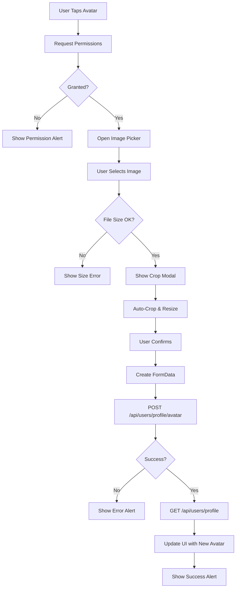

# Profile API Integration Reference

## 📡 API Endpoints Used

### 1. Fetch Profile
**Endpoint**: `GET /api/users/profile`

**Purpose**: Get current authenticated user's profile data

**Request**:
```typescript
// No body required, uses auth token from headers
const profile = await UserService.fetchProfile();
```

**Response**:
```json
{
  "success": true,
  "message": "Profile fetched successfully",
  "data": {
    "userId": 123,
    "email": "user@example.com",
    "fullName": "John Doe",
    "phone": "+1234567890",
    "status": "ACTIVE",
    "avatarUrl": "https://example.com/avatars/123.jpg",
    "studentCode": "STU123456",
    "majorName": "Computer Science",
    "bio": "Passionate about technology",
    "role": {
      "roleId": 1,
      "roleName": "STUDENT",
      "description": "Student role"
    },
    "wallet": {
      "balancePoints": 2500
    },
    "memberships": []
  }
}
```

**Usage in App**:
```typescript
const loadProfile = async () => {
  try {
    const profileData = await UserService.fetchProfile();
    setProfile(profileData);
    setFormData({
      fullName: profileData.fullName || '',
      phone: profileData.phone || '',
      majorName: profileData.majorName || '',
      bio: profileData.bio || '',
    });
    setAvatarPreview(profileData.avatarUrl);
  } catch (error) {
    console.error('Failed to load profile:', error);
  }
};
```

---

### 2. Edit Profile
**Endpoint**: `PUT /api/users/profile`

**Purpose**: Update current user's profile information

**Request**:
```typescript
interface EditProfileRequest {
  fullName?: string;
  phone?: string;
  majorName?: string;
  bio?: string;
  email?: string;
}

const updateData = {
  fullName: "John Doe",
  phone: "+1234567890",
  majorName: "Computer Science",
  bio: "Updated bio"
};

const response = await UserService.editProfile(updateData);
```

**Request Body**:
```json
{
  "fullName": "John Doe",
  "phone": "+1234567890",
  "majorName": "Computer Science",
  "bio": "Updated bio"
}
```

**Response**:
```json
{
  "success": true,
  "message": "Profile updated successfully",
  "data": null
}
```

**Usage in App**:
```typescript
const handleSave = async () => {
  try {
    setSaving(true);
    
    const updateData: EditProfileRequest = {
      fullName: formData.fullName,
      phone: formData.phone,
      majorName: formData.majorName,
      bio: formData.bio,
    };

    const response = await UserService.editProfile(updateData);
    
    if (response && response.success) {
      Alert.alert('Success', 'Your profile has been updated successfully!');
      setEditing(false);
      await loadProfile();
    } else {
      throw new Error(response?.message || 'Unable to update profile');
    }
  } catch (error) {
    Alert.alert('Error', 'An error occurred while updating profile');
  } finally {
    setSaving(false);
  }
};
```

---

### 3. Upload Avatar
**Endpoint**: `POST /api/users/profile/avatar`

**Purpose**: Upload a new profile picture

**Request**:
```typescript
const formData = new FormData();
formData.append('file', {
  uri: croppedImage.uri,
  type: 'image/jpeg',
  name: 'cropped-avatar.jpg',
} as any);

const response = await UserService.uploadAvatar(formData);
```

**Headers**:
```
Content-Type: multipart/form-data
Authorization: Bearer <token>
```

**Response**:
```json
{
  "success": true,
  "message": "Avatar uploaded successfully",
  "data": {
    "avatarUrl": "https://example.com/avatars/123-updated.jpg"
  }
}
```

**Usage in App**:
```typescript
const handleCropComplete = async (croppedImage: { uri: string }) => {
  try {
    setUploadingAvatar(true);
    
    const formData = new FormData();
    formData.append('file', {
      uri: croppedImage.uri,
      type: 'image/jpeg',
      name: 'cropped-avatar.jpg',
    } as any);

    const response = await UserService.uploadAvatar(formData);
    
    if (response && response.success) {
      Alert.alert('Success', 'Your avatar has been updated successfully!');
      await loadProfile(); // Reload to get new avatarUrl
    }
  } catch (error) {
    Alert.alert('Error', 'Failed to upload avatar');
  } finally {
    setUploadingAvatar(false);
  }
};
```

---

## 🔄 Complete Avatar Upload Flow



---

## 🔐 Authentication

All API calls use the authentication token from the auth store:

```typescript
// From axios.ts config
axiosClient.interceptors.request.use((config) => {
  const token = useAuthStore.getState().token;
  if (token) {
    config.headers.Authorization = `Bearer ${token}`;
  }
  return config;
});
```

---

## 🛡️ Error Handling

### Standard Error Response
```json
{
  "success": false,
  "message": "Error description",
  "data": null
}
```

### Common Error Scenarios

#### 1. Unauthorized (401)
```typescript
// User not logged in or token expired
{
  "success": false,
  "message": "Unauthorized access",
  "data": null
}
```

**App Handling**: Redirect to login screen

#### 2. Validation Error (400)
```typescript
// Invalid data in request
{
  "success": false,
  "message": "Phone number format is invalid",
  "data": null
}
```

**App Handling**: Show Alert with error message

#### 3. Server Error (500)
```typescript
{
  "success": false,
  "message": "Internal server error",
  "data": null
}
```

**App Handling**: Show generic error message, allow retry

#### 4. File Too Large (413)
```typescript
{
  "success": false,
  "message": "File size exceeds maximum allowed",
  "data": null
}
```

**App Handling**: Already prevented client-side (5MB check)

---

## 📊 Response Unwrapping

The UserService automatically unwraps responses:

```typescript
// API returns:
{
  "success": true,
  "message": "Success",
  "data": { userId: 123, fullName: "John" }
}

// Service returns:
{ userId: 123, fullName: "John" }

// Implementation:
static async fetchProfile(): Promise<UserProfile> {
  const response = await axiosClient.get<ProfileResponse>('/api/users/profile');
  const body = response.data;
  
  if (body && body.success && body.data) {
    return body.data; // Unwrapped!
  }
  
  throw new Error('Invalid profile response format');
}
```

---

## 🎯 State Management Integration

### Auth Store (Zustand)
```typescript
interface AuthState {
  user: User | null;
  token: string | null;
  // ... other auth state
}

// Used in profile for:
const { user } = useAuthStore();
const isAdminRole = ['uni_staff', 'uni_admin', 'admin', 'staff']
  .includes(user?.role || '');
```

### Local Component State
```typescript
// Profile data from API
const [profile, setProfile] = useState<UserProfile | null>(null);

// Form state (editable fields)
const [formData, setFormData] = useState({
  fullName: '',
  phone: '',
  majorName: '',
  bio: '',
});

// UI state
const [loading, setLoading] = useState(true);
const [saving, setSaving] = useState(false);
const [editing, setEditing] = useState(false);
const [uploadingAvatar, setUploadingAvatar] = useState(false);
```

---

## 🔄 Data Flow Diagram

```
┌─────────────┐
│   UI Layer  │
│ profile.tsx │
└──────┬──────┘
       │
       │ UserService.fetchProfile()
       ▼
┌─────────────┐
│  Service    │
│ UserService │
└──────┬──────┘
       │
       │ axiosClient.get()
       ▼
┌─────────────┐
│   Network   │
│ Axios HTTP  │
└──────┬──────┘
       │
       │ GET /api/users/profile
       ▼
┌─────────────┐
│   Backend   │
│  API Server │
└──────┬──────┘
       │
       │ JSON Response
       ▼
┌─────────────┐
│  Response   │
│ { success,  │
│   data }    │
└──────┬──────┘
       │
       │ Unwrap data
       ▼
┌─────────────┐
│  UI Update  │
│ setProfile()│
└─────────────┘
```

---

## 🧪 Testing the Integration

### Manual Testing Checklist

1. **Fetch Profile**
   - [ ] Load profile on app start
   - [ ] Handle missing data gracefully
   - [ ] Show loading state
   - [ ] Handle errors with retry option

2. **Edit Profile**
   - [ ] Update single field
   - [ ] Update multiple fields
   - [ ] Cancel editing
   - [ ] Validate before save
   - [ ] Show success message
   - [ ] Reload after save

3. **Upload Avatar**
   - [ ] Select image from gallery
   - [ ] Crop and preview
   - [ ] Upload and wait
   - [ ] See new avatar
   - [ ] Handle upload failures

### API Testing with cURL

```bash
# Fetch Profile
curl -X GET "https://api.example.com/api/users/profile" \
  -H "Authorization: Bearer YOUR_TOKEN"

# Edit Profile
curl -X PUT "https://api.example.com/api/users/profile" \
  -H "Authorization: Bearer YOUR_TOKEN" \
  -H "Content-Type: application/json" \
  -d '{
    "fullName": "John Doe",
    "phone": "+1234567890",
    "majorName": "Computer Science",
    "bio": "Test bio"
  }'

# Upload Avatar
curl -X POST "https://api.example.com/api/users/profile/avatar" \
  -H "Authorization: Bearer YOUR_TOKEN" \
  -F "file=@/path/to/image.jpg"
```

---

## 🔧 Debugging Tips

### Enable Logging
```typescript
// In UserService methods
console.log('Fetched profile response:', body);
console.log('Editing profile with data:', data);
console.log('Upload avatar response:', body);
```

### Network Monitoring
1. Use **React Native Debugger** network tab
2. Or Flipper's **Network Plugin**
3. Or proxy tools like **Charles/Proxyman**

### Common Issues

**Issue**: Profile not loading
- Check auth token is valid
- Verify API endpoint is correct
- Check network connection

**Issue**: Avatar upload fails
- Verify FormData format
- Check file size on device
- Ensure proper Content-Type header

**Issue**: Changes not persisting
- Verify PUT request is successful
- Check if reload happens after save
- Ensure form data is correct

---

## 📝 API Contract Summary

| Endpoint | Method | Purpose | Auth Required | Request Type | Response Type |
|----------|--------|---------|---------------|--------------|---------------|
| `/api/users/profile` | GET | Get profile | ✅ Yes | None | JSON |
| `/api/users/profile` | PUT | Update profile | ✅ Yes | JSON | JSON |
| `/api/users/profile/avatar` | POST | Upload avatar | ✅ Yes | FormData | JSON |

---

## 🎉 Best Practices

1. **Always handle errors gracefully**
   - Show user-friendly messages
   - Provide retry options
   - Log errors for debugging

2. **Optimize network calls**
   - Don't reload unnecessarily
   - Cache when appropriate
   - Use loading states

3. **Validate client-side**
   - Check file sizes before upload
   - Validate form fields before submit
   - Prevent duplicate requests

4. **Keep UI responsive**
   - Show loading indicators
   - Disable buttons during operations
   - Provide immediate feedback

---

**Need more details?** Check the full UserService implementation in `src/services/user.service.ts`

